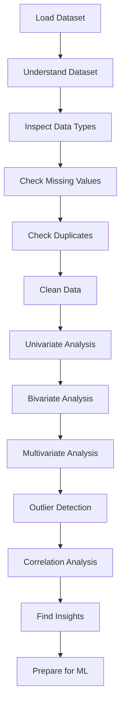

# 🔍 Exploratory Data Analysis (EDA) — Complete Guide

> **_Understand the data before asking the model to learn from it._** — *Core EDA Philosophy*

---

## 📖 Table of Contents

1. [What is EDA?](#-what-is-eda)
2. [Why EDA Matters](#-why-eda-matters)
3. [EDA Workflow Overview](#-eda-workflow-overview)
4. [Detailed Workflow Steps](#-detailed-workflow-steps)
5. [Specialized EDA Scenarios](#-specialized-eda-scenarios)
6. [Tools & Libraries](#-tools--libraries)
7. [Best Practices & Tips](#-best-practices--tips)
8. [Common Pitfalls](#-common-pitfalls)
9. [Resources & References](#-resources--references)

---

## 🧠 What is EDA?

**Exploratory Data Analysis (EDA)** is an approach to analyzing datasets to summarize their main characteristics, often using visual methods. It's the critical first step in any data science project.

### What EDA Helps Us Discover

| Category | Examples |
|----------|----------|
| **Data Structure** | Shape, columns, index, memory usage |
| **Data Quality** | Missing values, duplicates, inconsistencies |
| **Data Types** | Numerical, categorical, datetime, boolean |
| **Distributions** | Normal, skewed, uniform, bimodal |
| **Outliers** | Extreme values, anomalies |
| **Relationships** | Correlations, dependencies, interactions |
| **Patterns** | Trends, seasonality, clusters |

---

## 🎯 Why EDA Matters

| Benefit | Impact |
|---------|--------|
| **Prevents Garbage In, Garbage Out** | Catches data issues before modeling |
| **Informs Feature Engineering** | Reveals which features need transformation |
| **Guides Model Selection** | Helps choose appropriate algorithms |
| **Saves Time & Resources** | Avoids retraining on flawed data |
| **Builds Domain Understanding** | Connects data to business context |

---

## 📚 EDA Workflow Overview



### Text-Based Workflow

```text
Load Dataset
     ↓
Understand Dataset
     ↓
Inspect Data Types
     ↓
Check Missing Values
     ↓
Check Duplicates
     ↓
Clean Data
     ↓
Univariate Analysis
     ↓
Bivariate Analysis
     ↓
Multivariate Analysis
     ↓
Outlier Detection
     ↓
Correlation Analysis
     ↓
Find Insights
     ↓
Prepare for Machine Learning
```

---

## 🔬 Detailed Workflow Steps

### 1️⃣ Load Dataset

```python
import pandas as pd
import numpy as np

# Load from various sources
df = pd.read_csv('data.csv')
df = pd.read_excel('data.xlsx')
df = pd.read_json('data.json')
df = pd.read_sql('SELECT * FROM table', connection)
df = pd.read_parquet('data.parquet')

# Quick inspection
print(f"Shape: {df.shape}")        # (rows, columns)
print(df.head())       # First 5 rows
print(df.info())       # Column types, non-null counts, memory
```

**Key Checks:**
- [ ] File loads without errors
- [ ] Expected number of rows/columns
- [ ] Column names are readable
- [ ] No encoding issues

---

### 2️⃣ Understand Dataset

```python
# Basic overview
print(df.describe())           # Numerical summary statistics
print(df.describe(include='all'))  # All columns including categorical
print(df.columns.tolist())     # Column names
print(df.dtypes)               # Data types
print(df.memory_usage(deep=True)) # Memory usage per column
```

**Questions to Answer:**
- What does each column represent?
- What's the target variable (if supervised)?
- What's the business context?
- Are there any obvious data entry errors?

---

### 3️⃣ Inspect Data Types

```python
# Check current types
print(df.dtypes)

# Convert if needed
df['date_col'] = pd.to_datetime(df['date_col'], errors='coerce')
df['category_col'] = df['category_col'].astype('category')
df['numeric_col'] = pd.to_numeric(df['numeric_col'], errors='coerce')

# Verify conversions
print(df.dtypes)
print(f"Date parsing failures: {df['date_col'].isna().sum()}")
```

**Common Conversions:**

| From | To | When |
|------|-----|------|
| `object` | `datetime` | Date/time strings |
| `object` | `category` | Low-cardinality categorical |
| `float` | `int` | Whole numbers stored as float |
| `object` | `numeric` | Numbers stored as strings |

---

### 4️⃣ Check Missing Values

```python
# Overall missing count
missing_counts = df.isnull().sum()
print(missing_counts[missing_counts > 0])

# Percentage missing
missing_pct = (missing_counts / len(df)) * 100
print(missing_pct[missing_pct > 0].sort_values(ascending=False))

# Visualize missingness
import missingno as msno
msno.matrix(df)
msno.heatmap(df)
msno.dendrogram(df)

# Missingness pattern analysis
print(df.isnull().corr())  # Correlations between missingness
```

**Missing Data Mechanisms:**
| Type | Description | Test |
|------|-------------|------|
| **MCAR** | Missing Completely at Random | Little's MCAR test |
| **MAR** | Missing at Random | Logistic regression on missingness |
| **MNAR** | Missing Not at Random | Domain knowledge required |

**Missing Data Strategies:**

| Strategy | When to Use | Code Example |
|----------|-------------|--------------|
| **Drop rows** | Few missing, MCAR | `df.dropna()` |
| **Drop columns** | >50% missing | `df.dropna(axis=1, thresh=len(df)*0.5)` |
| **Mean/Median impute** | Numerical, MCAR | `df.fillna(df.median())` |
| **Mode impute** | Categorical | `df.fillna(df.mode().iloc[0])` |
| **Forward/Backward fill** | Time series | `df.ffill()` / `df.bfill()` |
| **Model-based impute** | MAR, enough data | `IterativeImputer()` |
| **Flag + impute** | Missingness is informative | `df['col_missing'] = df['col'].isnull().astype(int)` |

---

### 5️⃣ Check Duplicates

```python
# Check duplicates
print(f"Total duplicates: {df.duplicated().sum()}")

# View duplicates
dupes = df[df.duplicated(keep=False)]
print(dupes.sort_values(by=df.columns.tolist()))

# Drop duplicates
df = df.drop_duplicates()

# Check specific columns (e.g., primary key)
print(df.duplicated(subset=['id', 'date']).sum())
```

---

### 6️⃣ Clean Data

```python
# Vectorized string operations (faster than apply)
str_cols = df.select_dtypes(include='object').columns
df[str_cols] = df[str_cols].apply(lambda x: x.str.strip())

# Standardize categorical values
df['gender'] = df['gender'].str.lower().map({'m': 'Male', 'f': 'Female'})

# Fix inconsistent formats using vectorized operations
df['phone'] = df['phone'].str.replace(r'\D', '', regex=True)

# Handle outliers (see Step 10)
# ...

# Reset index after cleaning
df = df.reset_index(drop=True)
```

**Data Quality Dimensions to Validate:**
- **Completeness** — No missing required fields
- **Uniqueness** — No duplicate primary keys
- **Consistency** — Same format across records
- **Validity** — Values conform to domain rules
- **Accuracy** — Values match real-world truth
- **Timeliness** — Data is up-to-date

---

### 7️⃣ Univariate Analysis (Single Variable)

#### Numerical Variables

```python
import matplotlib.pyplot as plt
import seaborn as sns
import numpy as np
import scipy.stats as stats

def plot_numerical_distribution(df, col, figsize=(12, 10)):
    """Comprehensive distribution analysis for numerical column."""
    fig, axes = plt.subplots(2, 2, figsize=figsize)
    
    # Histogram + KDE
    sns.histplot(df[col].dropna(), kde=True, ax=axes[0,0])
    axes[0,0].set_title(f'{col}: Histogram + KDE')
    
    # Box plot
    sns.boxplot(x=df[col].dropna(), ax=axes[0,1])
    axes[0,1].set_title(f'{col}: Box Plot')
    
    # Violin plot
    sns.violinplot(x=df[col].dropna(), ax=axes[1,0])
    axes[1,0].set_title(f'{col}: Violin Plot')
    
    # Q-Q plot (normality check)
    stats.probplot(df[col].dropna(), dist="norm", plot=axes[1,1])
    axes[1,1].set_title(f'{col}: Q-Q Plot')
    
    plt.tight_layout()
    plt.show()
    
    # Summary statistics
    print(f"\n=== {col} Statistics ===")
    print(df[col].describe())
    print(f"Skewness: {df[col].skew():.3f}")
    print(f"Kurtosis: {df[col].kurtosis():.3f}")
    
    # Normality tests
    from scipy.stats import shapiro, normaltest
    stat, p = shapiro(df[col].dropna().sample(min(5000, len(df))))
    print(f"Shapiro-Wilk p-value: {p:.4f} {'(Normal)' if p > 0.05 else '(Non-normal)'}")

# Usage
plot_numerical_distribution(df, 'target_column')
```

#### Categorical Variables

```python
def plot_categorical_distribution(df, col, max_categories=20):
    """Comprehensive distribution analysis for categorical column."""
    vc = df[col].value_counts()
    vc_pct = df[col].value_counts(normalize=True).mul(100).round(2)
    
    print(f"\n=== {col} Distribution ===")
    print(pd.DataFrame({'count': vc, 'pct': vc_pct}))
    
    # Bar plot (horizontal for readability)
    top_cats = vc.head(max_categories)
    plt.figure(figsize=(10, max(6, len(top_cats) * 0.3)))
    sns.barplot(x=top_cats.values, y=top_cats.index, orient='h')
    plt.title(f'{col}: Top {max_categories} Categories')
    plt.xlabel('Count')
    plt.show()
    
    # Pie chart (only for few categories)
    if len(vc) <= 6:
        vc.plot.pie(autopct='%1.1f%%', figsize=(8, 8))
        plt.title(f'{col}: Distribution')
        plt.ylabel('')
        plt.show()
```

---

### 8️⃣ Bivariate Analysis (Two Variables)

#### Numerical vs Numerical

```python
def plot_numerical_vs_numerical(df, x, y, hue=None, sample_size=5000):
    """Scatter, regression, and correlation analysis."""
    plot_df = df[[x, y]].dropna()
    if len(plot_df) > sample_size:
        plot_df = plot_df.sample(sample_size, random_state=42)
        if hue and hue in df.columns:
            plot_df[hue] = df.loc[plot_df.index, hue]
    
    fig, axes = plt.subplots(1, 2, figsize=(14, 5))
    
    # Scatter plot
    sns.scatterplot(data=plot_df, x=x, y=y, hue=hue, alpha=0.6, ax=axes[0])
    axes[0].set_title(f'{x} vs {y}')
    
    # Regression plot
    sns.regplot(data=plot_df, x=x, y=y, scatter_kws={'alpha': 0.3}, ax=axes[1])
    axes[1].set_title(f'{x} vs {y} (Regression)')
    
    plt.tight_layout()
    plt.show()
    
    # Correlations
    pearson = df[x].corr(df[y])
    spearman = df[x].corr(df[y], method='spearman')
    kendall = df[x].corr(df[y], method='kendall')
    
    print(f"Pearson (linear): {pearson:.3f}")
    print(f"Spearman (monotonic): {spearman:.3f}")
    print(f"Kendall (ordinal): {kendall:.3f}")
```

#### Categorical vs Numerical

```python
def plot_categorical_vs_numerical(df, cat_col, num_col, max_categories=15):
    """Box, violin, and statistical tests."""
    # Limit categories for readability
    top_cats = df[cat_col].value_counts().head(max_categories).index
    plot_df = df[df[cat_col].isin(top_cats)].copy()
    
    fig, axes = plt.subplots(1, 2, figsize=(14, 5))
    
    # Box plot
    sns.boxplot(data=plot_df, x=cat_col, y=num_col, ax=axes[0])
    axes[0].set_title(f'{num_col} by {cat_col}')
    axes[0].tick_params(axis='x', rotation=45)
    
    # Violin plot
    sns.violinplot(data=plot_df, x=cat_col, y=num_col, ax=axes[1])
    axes[1].set_title(f'{num_col} by {cat_col} (Density)')
    axes[1].tick_params(axis='x', rotation=45)
    
    plt.tight_layout()
    plt.show()
    
    # Statistical tests
    from scipy.stats import f_oneway, kruskal
    groups = [plot_df[plot_df[cat_col]==cat][num_col].dropna() 
              for cat in plot_df[cat_col].unique()]
    
    # ANOVA (assumes normality, equal variance)
    if all(len(g) > 2 for g in groups):
        f_stat, p_val = f_oneway(*groups)
        print(f"ANOVA: F={f_stat:.3f}, p={p_val:.4f}")
    
    # Kruskal-Wallis (non-parametric)
    h_stat, p_val = kruskal(*groups)
    print(f"Kruskal-Wallis: H={h_stat:.3f}, p={p_val:.4f}")
```

#### Categorical vs Categorical

```python
def plot_categorical_vs_categorical(df, cat1, cat2, normalize='index'):
    """Crosstab, heatmap, and chi-square test."""
    ct = pd.crosstab(df[cat1], df[cat2], normalize=normalize) * 100
    print(ct.round(2))
    
    fig, axes = plt.subplots(1, 2, figsize=(14, 5))
    
    # Heatmap
    sns.heatmap(ct, annot=True, fmt='.1f', cmap='Blues', ax=axes[0])
    axes[0].set_title(f'{cat1} vs {cat2} (% by {normalize})')
    
    # Stacked bar
    ct.plot(kind='bar', stacked=True, ax=axes[1], colormap='tab20')
    axes[1].set_title(f'Stacked: {cat1} vs {cat2}')
    axes[1].tick_params(axis='x', rotation=45)
    axes[1].legend(bbox_to_anchor=(1.05, 1), loc='upper left')
    
    plt.tight_layout()
    plt.show()
    
    # Chi-square test
    from scipy.stats import chi2_contingency
    chi2, p, dof, expected = chi2_contingency(pd.crosstab(df[cat1], df[cat2]))
    print(f"Chi-square: χ²={chi2:.3f}, p={p:.4f}, dof={dof}")
    
    # Cramér's V (effect size)
    n = pd.crosstab(df[cat1], df[cat2]).sum().sum()
    cramers_v = np.sqrt(chi2 / (n * (min(ct.shape) - 1)))
    print(f"Cramér's V: {cramers_v:.3f}")
```

---

### 9️⃣ Multivariate Analysis (Three+ Variables)

```python
import numpy as np

# Pair plot (subset for performance)
numeric_df = df.select_dtypes(include='number')
if len(numeric_df) > 1000:
    sample_df = numeric_df.sample(1000, random_state=42)
else:
    sample_df = numeric_df

# Add target for coloring if available
if 'target' in df.columns:
    sample_df['target'] = df.loc[sample_df.index, 'target']
    sns.pairplot(sample_df, hue='target', diag_kind='kde', corner=True)
else:
    sns.pairplot(sample_df, diag_kind='kde', corner=True)
plt.show()

# Correlation heatmap
plt.figure(figsize=(14, 12))
corr_matrix = numeric_df.corr()
mask = np.triu(np.ones_like(corr_matrix, dtype=bool))
sns.heatmap(corr_matrix, mask=mask, annot=True, fmt='.2f', 
            cmap='RdBu_r', center=0, square=True, linewidths=0.5)
plt.title('Correlation Matrix (Lower Triangle)')
plt.show()

# Parallel coordinates
from pandas.plotting import parallel_coordinates
if 'target' in df.columns:
    parallel_coordinates(df.sample(min(200, len(df))), 'target', colormap='viridis')
    plt.title('Parallel Coordinates')
    plt.xticks(rotation=45)
    plt.show()

# 3D scatter (interactive)
import plotly.express as px
if all(c in df.columns for c in ['feat1', 'feat2', 'feat3']):
    fig = px.scatter_3d(df.sample(min(5000, len(df))), 
                        x='feat1', y='feat2', z='feat3', 
                        color='target' if 'target' in df.columns else None)
    fig.show()
```

---

### 🔟 Outlier Detection

```python
import numpy as np
from scipy.stats import zscore
from sklearn.ensemble import IsolationForest
from sklearn.neighbors import LocalOutlierFactor

def detect_outliers_iqr(df, col, multiplier=1.5):
    """IQR-based outlier detection."""
    Q1 = df[col].quantile(0.25)
    Q3 = df[col].quantile(0.75)
    IQR = Q3 - Q1
    lower = Q1 - multiplier * IQR
    upper = Q3 + multiplier * IQR
    return df[(df[col] < lower) | (df[col] > upper)], lower, upper

def detect_outliers_zscore(df, col, threshold=3):
    """Z-score based outlier detection."""
    z = zscore(df[col].dropna())
    outliers = df.loc[df[col].dropna().index][np.abs(z) > threshold]
    return outliers

def detect_outliers_isolation_forest(df, contamination=0.01):
    """Multivariate outlier detection using Isolation Forest."""
    numeric_df = df.select_dtypes(include='number').dropna()
    iso = IsolationForest(contamination=contamination, random_state=42)
    preds = iso.fit_predict(numeric_df)
    return df.loc[numeric_df.index][preds == -1]

def detect_outliers_lof(df, n_neighbors=20, contamination=0.01):
    """Local Outlier Factor for density-based detection."""
    numeric_df = df.select_dtypes(include='number').dropna()
    lof = LocalOutlierFactor(n_neighbors=n_neighbors, contamination=contamination)
    preds = lof.fit_predict(numeric_df)
    return df.loc[numeric_df.index][preds == -1]

# Example usage
outliers_iqr, lower, upper = detect_outliers_iqr(df, 'numeric_column')
outliers_z = detect_outliers_zscore(df, 'numeric_column')
outliers_iso = detect_outliers_isolation_forest(df)
outliers_lof = detect_outliers_lof(df)

# Visualize
fig, axes = plt.subplots(1, 2, figsize=(14, 5))
sns.boxplot(x=df['numeric_column'], ax=axes[0])
axes[0].axvline(lower, color='red', linestyle='--', label='Lower bound')
axes[0].axvline(upper, color='red', linestyle='--', label='Upper bound')
axes[0].legend()
axes[0].set_title('IQR Outlier Bounds')

if len(outliers_iso) > 0:
    sns.scatterplot(data=df, x='feat1', y='feat2', 
                    hue=df.index.isin(outliers_iso.index), ax=axes[1])
axes[1].set_title('Isolation Forest Outliers')
plt.show()
```

**Outlier Handling Strategies:**

| Strategy | Code | When to Use |
|----------|------|-------------|
| **Cap/Floor (Winsorize)** | `df['col'] = df['col'].clip(lower, upper)` | Preserve sample size, reduce impact |
| **Remove** | `df = df[(df['col'] >= lower) & (df['col'] <= upper)]` | True anomalies, small proportion |
| **Transform** | `df['col_log'] = np.log1p(df['col'])` | Right-skewed distributions |
| **Keep with flag** | `df['is_outlier'] = (df['col'] < lower) | (df['col'] > upper)` | Outliers may be informative |

---

### 1️⃣1️⃣ Correlation Analysis

```python
# Multiple correlation methods
numeric_df = df.select_dtypes(include='number')

pearson_corr = numeric_df.corr(method='pearson')
spearman_corr = numeric_df.corr(method='spearman')
kendall_corr = numeric_df.corr(method='kendall')

# Focus on target correlations
if 'target' in numeric_df.columns:
    target_corr = pearson_corr['target'].sort_values(ascending=False)
    print("Top correlations with target:")
    print(target_corr.head(15))

# Visualize correlation matrix
plt.figure(figsize=(14, 12))
mask = np.triu(np.ones_like(pearson_corr, dtype=bool))
sns.heatmap(pearson_corr, mask=mask, annot=True, fmt='.2f', 
            cmap='RdBu_r', center=0, square=True, linewidths=0.5,
            cbar_kws={'shrink': 0.8})
plt.title('Pearson Correlation Matrix')
plt.tight_layout()
plt.show()

# High correlation pairs (multicollinearity check)
high_corr_pairs = (
    pearson_corr.abs()
    .where(mask)
    .unstack()
    .sort_values(ascending=False)
    .dropna()
)
print("High correlation pairs (>0.8):")
print(high_corr_pairs[high_corr_pairs > 0.8].head(20))
```

---

### 1️⃣2️⃣ Find Insights & Document

```python
# Create structured insights summary
insights = {
    'dataset_shape': df.shape,
    'missing_values': df.isnull().sum().to_dict(),
    'duplicates_removed': initial_rows - len(df) if 'initial_rows' in locals() else 0,
    'outliers_found': len(outliers_iqr) if 'outliers_iqr' in locals() else 0,
    'target_distribution': df['target'].value_counts().to_dict() if 'target' in df.columns else {},
    'top_correlations': target_corr.head(10).to_dict() if 'target_corr' in locals() else {},
    'key_findings': [
        "Feature X has strong correlation with target (0.85)",
        "Category A represents 60% of data - potential imbalance",
        "Feature Y has 15% missing values - needs imputation",
        "Outliers detected in Feature Z - consider capping"
    ],
    'recommendations': [
        "Apply log transform to Feature Z",
        "Use SMOTE or class weights for target imbalance",
        "Investigate missingness pattern in Feature Y",
        "Consider feature selection for multicollinear features"
    ]
}

# Save for reporting
import json
with open('eda_insights.json', 'w') as f:
    json.dump(insights, f, indent=2, default=str)

# Also create markdown report
with open('eda_report.md', 'w') as f:
    f.write(f"# EDA Report\n\n")
    f.write(f"**Dataset Shape:** {df.shape}\n\n")
    f.write(f"## Key Findings\n")
    for finding in insights['key_findings']:
        f.write(f"- {finding}\n")
    f.write(f"\n## Recommendations\n")
    for rec in insights['recommendations']:
        f.write(f"- {rec}\n")
```

---

### 1️⃣3️⃣ Prepare for Machine Learning (No Data Leakage!)

```python
from sklearn.model_selection import train_test_split
from sklearn.preprocessing import StandardScaler, RobustScaler, LabelEncoder
from sklearn.compose import ColumnTransformer
from sklearn.pipeline import Pipeline
import joblib

# 1. Split FIRST - prevent data leakage!
X = df.drop('target', axis=1)
y = df['target']
X_train, X_test, y_train, y_test = train_test_split(
    X, y, test_size=0.2, random_state=42, stratify=y
)

# 2. Identify column types
numeric_cols = X_train.select_dtypes(include='number').columns.tolist()
categorical_cols = X_train.select_dtypes(include=['object', 'category']).columns.tolist()

# 3. Create preprocessing pipelines
# For numerical: impute + scale
numeric_transformer = Pipeline(steps=[
    ('imputer', SimpleImputer(strategy='median')),
    ('scaler', RobustScaler())  # Robust to outliers
])

# For categorical: impute + encode
categorical_transformer = Pipeline(steps=[
    ('imputer', SimpleImputer(strategy='most_frequent')),
    ('encoder', OneHotEncoder(handle_unknown='ignore', drop='first'))
])

# 4. Combine with ColumnTransformer
preprocessor = ColumnTransformer(
    transformers=[
        ('num', numeric_transformer, numeric_cols),
        ('cat', categorical_transformer, categorical_cols)
    ])

# 5. Fit on TRAIN only, transform both
X_train_processed = preprocessor.fit_transform(X_train)
X_test_processed = preprocessor.transform(X_test)

# 6. Save artifacts for production
joblib.dump(preprocessor, 'preprocessor.pkl')
joblib.dump(X_train.columns.tolist(), 'feature_names.pkl')

# 7. Save processed data
pd.DataFrame(X_train_processed).to_parquet('X_train.parquet')
pd.DataFrame(X_test_processed).to_parquet('X_test.parquet')
y_train.to_frame().to_parquet('y_train.parquet')
y_test.to_frame().to_parquet('y_test.parquet')
```

---

## 🎯 Specialized EDA Scenarios

### Time Series EDA

```python
def time_series_eda(df, date_col, value_col, freq='D'):
    """Comprehensive time series exploration."""
    df = df.copy()
    df[date_col] = pd.to_datetime(df[date_col])
    df = df.set_index(date_col).sort_index()
    
    # Resample if needed
    ts = df[value_col].resample(freq).mean()
    
    fig, axes = plt.subplots(3, 1, figsize=(14, 12))
    
    # Time series plot
    ts.plot(ax=axes[0])
    axes[0].set_title(f'{value_col} over Time')
    
    # Seasonal decomposition
    from statsmodels.tsa.seasonal import seasonal_decompose
    decomposition = seasonal_decompose(ts.dropna(), period=365 if freq=='D' else 12)
    decomposition.plot(ax=axes[1])
    
    # ACF/PACF
    from statsmodels.graphics.tsaplots import plot_acf, plot_pacf
    plot_acf(ts.dropna(), ax=axes[2], lags=40)
    axes[2].set_title('Autocorrelation')
    
    plt.tight_layout()
    plt.show()
    
    # Stationarity test
    from statsmodels.tsa.stattools import adfuller
    result = adfuller(ts.dropna())
    print(f"ADF Statistic: {result[0]:.4f}, p-value: {result[1]:.4f}")
    print("Stationary" if result[1] < 0.05 else "Non-stationary")
```

### Text/NLP EDA

```python
def text_eda(df, text_col, target_col=None):
    """Explore text data characteristics."""
    df = df.copy()
    
    # Basic stats
    df['char_count'] = df[text_col].str.len()
    df['word_count'] = df[text_col].str.split().str.len()
    df['unique_words'] = df[text_col].apply(lambda x: len(set(str(x).split())))
    
    print("Text Statistics:")
    print(df[['char_count', 'word_count', 'unique_words']].describe())
    
    # Visualizations
    fig, axes = plt.subplots(1, 3, figsize=(15, 5))
    sns.histplot(df['char_count'], ax=axes[0])
    axes[0].set_title('Character Count')
    sns.histplot(df['word_count'], ax=axes[1])
    axes[1].set_title('Word Count')
    sns.histplot(df['unique_words'], ax=axes[2])
    axes[2].set_title('Unique Words')
    plt.show()
    
    # Most common words
    from collections import Counter
    all_words = ' '.join(df[text_col].astype(str)).lower().split()
    common_words = Counter(all_words).most_common(20)
    print(f"Top 20 words: {common_words}")
    
    # Word cloud
    from wordcloud import WordCloud
    wc = WordCloud(width=800, height=400, background_color='white').generate(' '.join(all_words))
    plt.figure(figsize=(12, 6))
    plt.imshow(wc, interpolation='bilinear')
    plt.axis('off')
    plt.show()
    
    # By target if available
    if target_col and target_col in df.columns:
        for target_val in df[target_col].unique():
            subset = df[df[target_col] == target_val]
            words = ' '.join(subset[text_col].astype(str)).lower().split()
            wc = WordCloud(width=400, height=200).generate(' '.join(words))
            plt.figure(figsize=(6, 3))
            plt.imshow(wc)
            plt.title(f'Target: {target_val}')
            plt.axis('off')
            plt.show()
```

---

## 🛠 Tools & Libraries

### Core Python Stack

| Library | Purpose | Install |
|---------|---------|---------|
| **pandas** | Data manipulation & analysis | `pip install pandas` |
| **polars** | Fast DataFrame (Rust backend) | `pip install polars` |
| **numpy** | Numerical computing | `pip install numpy` |
| **matplotlib** | Basic plotting | `pip install matplotlib` |
| **seaborn** | Statistical visualizations | `pip install seaborn` |
| **plotly** | Interactive plots | `pip install plotly` |

### EDA-Specific Libraries

| Library | Purpose | Highlights |
|---------|---------|------------|
| **ydata-profiling** | Automated EDA reports | `df.profile_report()` (formerly pandas-profiling) |
| **sweetviz** | Visual EDA reports | Comparison, associations |
| **dtale** | Interactive data viewer | Spreadsheet-like UI |
| **missingno** | Missing data visualization | Matrix, heatmap, dendrogram |
| **autoviz** | Auto visualization | `AutoViz_Class().AutoViz()` |
| **dataprep** | EDA + data preparation | `create_report(df)` |

### Data Validation & Quality

| Library | Purpose | Key Feature |
|---------|---------|-------------|
| **great_expectations** | Data validation/testing | Expectation suites, checkpoints |
| **pandera** | Schema validation | DataFrame schemas, type checking |
| **evidently** | Data drift monitoring | Reports, dashboards, tests |

### SQL on DataFrames

| Library | Purpose |
|---------|---------|
| **duckdb** | Fast analytical SQL on DataFrames |
| **polars** | Lazy evaluation, SQL context |

### Statistical & ML Prep

| Library | Purpose |
|---------|---------|
| **scipy.stats** | Statistical tests |
| **statsmodels** | Advanced statistics, time series |
| **scikit-learn** | Preprocessing, model selection |
| **feature-engine** | Feature engineering transformers |
| **category_encoders** | Advanced categorical encoding |

---

## ✅ Best Practices & Tips

### Do's ✅
- [ ] **Start with questions** — Know what you're looking for
- [ ] **Visualize first** — Plots reveal patterns tables miss
- [ ] **Check assumptions** — Normality, homoscedasticity, independence
- [ ] **Document everything** — Insights, decisions, transformations
- [ ] **Version your data** — Track changes with DVC or similar
- [ ] **Automate repetitive EDA** — Build reusable functions/classes
- [ ] **Share findings** — Use notebooks, reports, dashboards
- [ ] **Validate data quality** — Use pandera/great_expectations schemas
- [ ] **Use colorblind-safe palettes** — `viridis`, `colorcet`, `tab10`
- [ ] **Set random seeds** — For reproducibility

### Don'ts ❌
- [ ] **Don't skip EDA** — Even for "clean" datasets
- [ ] **Don't impute blindly** — Understand *why* data is missing
- [ ] **Don't remove outliers without investigation** — They may be signal
- [ ] **Don't ignore class imbalance** — It affects model performance
- [ ] **Don't leak target info** — No target-based transformations before split
- [ ] **Don't over-engineer** — Simple models on good features > complex on bad
- [ ] **Don't use default parameters blindly** — Understand what they do

### Pro Tips 💡

```python
# 1. Create a reusable EDA class
class EDAAnalyzer:
    def __init__(self, df, target=None, random_state=42):
        self.df = df.copy()
        self.target = target
        self.random_state = random_state
        self.insights = {}
    
    def overview(self):
        print(f"Shape: {self.df.shape}")
        print(f"Memory: {self.df.memory_usage(deep=True).sum() / 1e6:.1f} MB")
        print(f"Dtypes:\n{self.df.dtypes.value_counts()}")
        print(f"Missing:\n{self.df.isnull().sum().sort_values(ascending=False)}")
        print(f"Duplicates: {self.df.duplicated().sum()}")
        if self.target:
            print(f"Target distribution:\n{self.df[self.target].value_counts(normalize=True)}")
    
    def plot_distributions(self, max_cols=10):
        numeric = self.df.select_dtypes(include='number').columns[:max_cols]
        for col in numeric:
            plot_numerical_distribution(self.df, col)
    
    def correlation_analysis(self, threshold=0.8):
        corr = self.df.select_dtypes(include='number').corr()
        high = corr.abs().where(np.triu(np.ones_like(corr, dtype=bool), k=1)).unstack()
        return high[high > threshold].sort_values(ascending=False)

# Usage
eda = EDAAnalyzer(df, target='target')
eda.overview()
eda.plot_distributions()
high_corr = eda.correlation_analysis()

# 2. Method chaining for clean data pipelines
clean_df = (df
    .drop_duplicates()
    .dropna(subset=['critical_col'])
    .assign(
        date=lambda x: pd.to_datetime(x['date'], errors='coerce'),
        category=lambda x: x['category'].astype('category')
    )
    .query('value > 0')
    .reset_index(drop=True)
)

# 3. Automated profile report
from ydata_profiling import ProfileReport
profile = ProfileReport(df, title="EDA Report", explorative=True, 
                        minimal=True,  # Faster for large datasets
                        correlations={"pearson": {"calculate": True},
                                    "spearman": {"calculate": True},
                                    "kendall": {"calculate": False}})
profile.to_file("eda_report.html")

# 4. Data validation with pandera
import pandera as pa
from pandera import Column, Check

schema = pa.DataFrameSchema({
    "age": Column(int, Check.in_range(0, 120)),
    "email": Column(str, Check.str_matches(r"^[^@]+@[^@]+\.[^@]+$")),
    "signup_date": Column(pa.DateTime),
    "status": Column(str, Check.isin(["active", "inactive", "pending"]))
})
validated_df = schema.validate(df)  # Raises error if invalid
```

---

## ⚠️ Common Pitfalls

| Pitfall | Consequence | Solution |
|---------|-------------|----------|
| **Ignoring missing data pattern** | Biased imputation | Check MCAR/MAR/MNAR |
| **Using mean for skewed data** | Distorts distribution | Use median or model-based |
| **Encoding before split** | Data leakage | Fit encoder on train only |
| **Scaling before split** | Data leakage | Fit scaler on train only |
| **Dropping all outliers** | Loss of information | Investigate first |
| **Correlation ≠ Causation** | Wrong features | Domain knowledge + experiments |
| **Single train-test split** | Unreliable estimates | Use cross-validation |
| **Ignoring data drift** | Model degradation in prod | Monitor with evidently |
| **Not validating schemas** | Silent data corruption | Use pandera/great_expectations |
| **Using jet/rainbow colormaps** | Misleading, inaccessible | Use viridis, cividis, plasma |

---

## 📚 Resources & References

### Books
- **"Exploratory Data Analysis"** — John Tukey (Classic)
- **"Python for Data Analysis"** — Wes McKinney
- **"Hands-On Exploratory Data Analysis with Python"** — Suresh Kumar Mukhiya
- **"Storytelling with Data"** — Cole Nussbaumer Knaflic
- **"Fundamentals of Data Visualization"** — Claus Wilke

### Courses & Tutorials
- [Kaggle EDA Micro-Course](https://www.kaggle.com/learn/data-visualization)
- [Data School: EDA in Python](https://www.dataschool.io/)
- [Python Data Science Handbook - EDA Chapter](https://jakevdp.github.io/PythonDataScienceHandbook/)

### Documentation
- [pandas User Guide](https://pandas.pydata.org/docs/user_guide/index.html)
- [seaborn Tutorial](https://seaborn.pydata.org/tutorial.html)
- [ydata-profiling Docs](https://github.com/ydataai/ydata-profiling)
- [pandera Docs](https://pandera.readthedocs.io/)
- [great_expectations Docs](https://docs.greatexpectations.io/)
- [evidently Docs](https://docs.evidentlyai.com/)

### Cheat Sheets
- [pandas Cheat Sheet](https://pandas.pydata.org/Pandas_Cheat_Sheet.pdf)
- [seaborn Cheat Sheet](https://github.com/mwaskom/seaborn/blob/master/cheatsheet.pdf)
- [Data Wrangling Cheat Sheet](https://www.rstudio.com/wp-content/uploads/2015/02/data-wrangling-cheatsheet.pdf)

### Visualization Best Practices
- [ColorBrewer](https://colorbrewer2.org/) — Colorblind-safe palettes
- [Data Viz Catalogue](https://datavizcatalogue.com/) — Chart selection guide
- [From Data to Viz](https://www.data-to-viz.com/) — Decision tree for charts

---

## 📁 This Repository's EDA Notebook

See [`eda_final_workout.ipynb`](./eda_final_workout.ipynb) for a complete hands-on example following this workflow.

---

## 📋 Quick EDA Checklist

Copy this into your notebook to track progress:

```markdown
# EDA Checklist for [Dataset Name]

## Data Loading & Understanding
- [ ] Data loaded successfully
- [ ] Shape verified (rows × cols)
- [ ] Column names understood
- [ ] Data types appropriate
- [ ] Target variable identified
- [ ] Business context documented

## Data Quality
- [ ] Missing values quantified
- [ ] Missingness pattern analyzed (MCAR/MAR/MNAR)
- [ ] Duplicates checked and handled
- [ ] Data validation schema applied
- [ ] Outliers detected (multiple methods)
- [ ] Outliers investigated (not just removed)

## Exploration
- [ ] Univariate: All numerical distributions plotted
- [ ] Univariate: All categorical distributions plotted
- [ ] Bivariate: Target vs each feature analyzed
- [ ] Multivariate: Correlation matrix reviewed
- [ ] Multivariate: High collinearity pairs identified
- [ ] Time series patterns checked (if applicable)
- [ ] Text features explored (if applicable)

## Insights & Documentation
- [ ] Key findings summarized
- [ ] Recommendations documented
- [ ] EDA report generated (HTML/Markdown)
- [ ] Insights saved as JSON for pipeline

## ML Preparation
- [ ] Train/test split performed FIRST
- [ ] Preprocessing pipeline built (ColumnTransformer)
- [ ] Pipeline fit on train only
- [ ] Transformers saved (joblib)
- [ ] Processed data saved (parquet)
- [ ] Feature names saved
```

---

*Last updated: 2024 | Part of the AI Engineer Journey*
```

---

*Generated with ❤️ for the AI Engineering community*