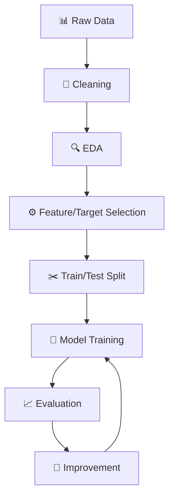
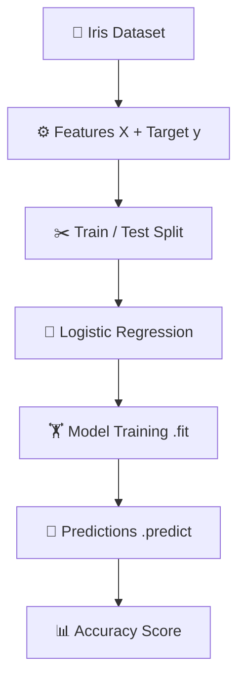
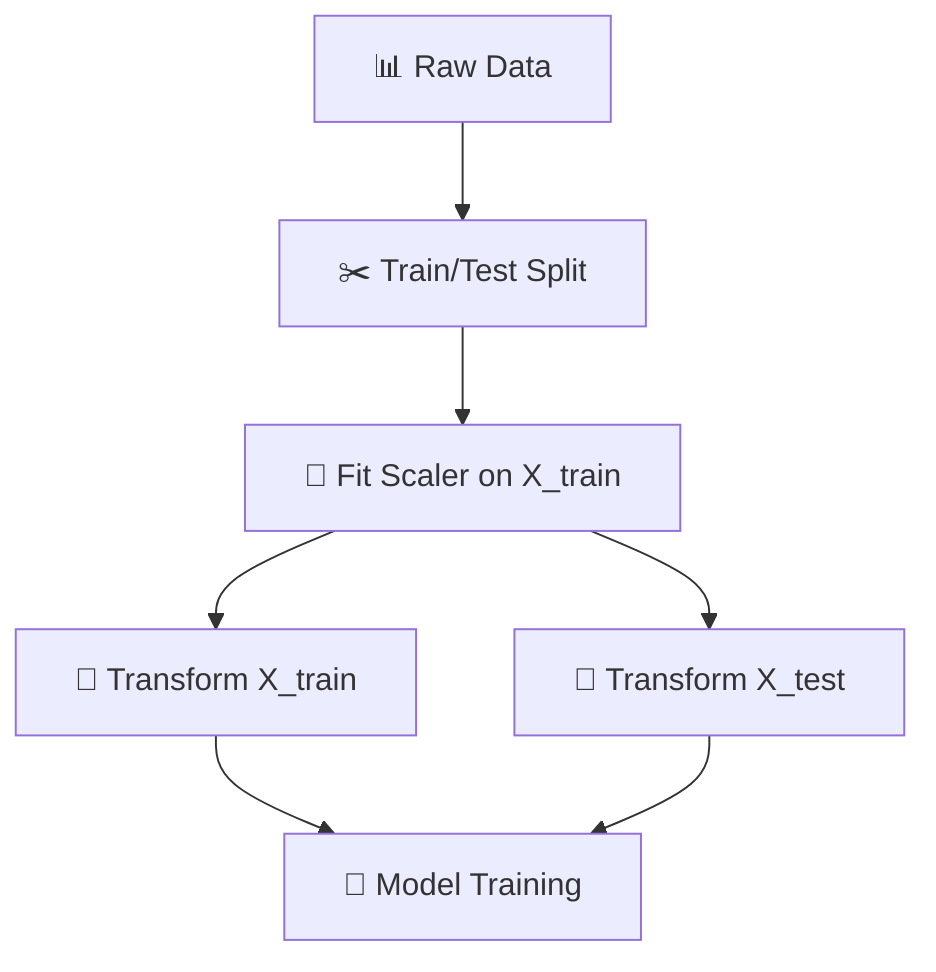
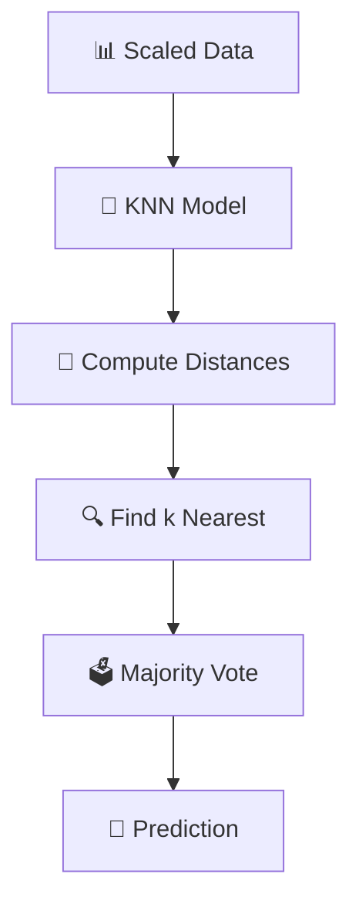
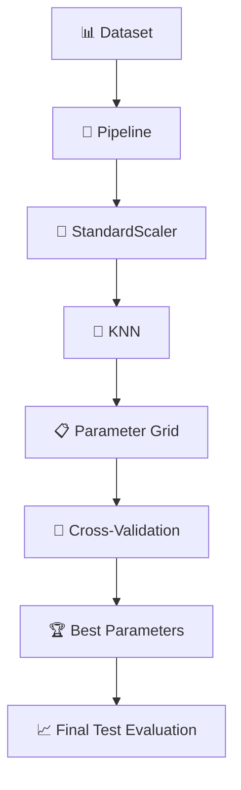

# Machine Learning Journey 🤖

> **Learning Path:** 84 Days of Machine Learning — From EDA to Production-Ready Models

---

## 📚 Table of Contents

- [Day 31: Machine Learning Workflow Fundamentals](#day-31-machine-learning-workflow-fundamentals)
- [Day 32: First ML Model — Logistic Regression](#day-32-first-ml-model--logistic-regression)
- [Day 33: Model Evaluation & Metrics](#day-33-model-evaluation--metrics)
- [Day 34: Feature Scaling & Preprocessing Pipeline](#day-34-feature-scaling--preprocessing-pipeline)
- [Day 35: K-Nearest Neighbors (KNN) Classification](#day-35-k-nearest-neighbors-knn-classification)
- [Day 36: Hyperparameter Tuning with GridSearchCV & Pipelines](#day-36-hyperparameter-tuning-with-gridsearchcv--pipelines)
- [🧠 Synthesis: Days 34–36 Connected ML Workflow](#-synthesis-days-3436-connected-ml-workflow)
- [🛠️ Technologies & Libraries](#️-technologies--libraries)
- [📁 Repository Structure](#-repository-structure)
- [🔗 Quick Links](#-quick-links)

---

## Day 31: Machine Learning Workflow Fundamentals

**Date:** Day 31/84 | **Focus:** Transitioning from EDA to Machine Learning

### 🎯 Learning Objectives

- [x] Understand the difference between features (**X**) and target (**y**)
- [x] Master train/test splitting with `train_test_split()`
- [x] Configure `test_size`, `random_state`, and `stratify` parameters
- [x] Apply the complete ML workflow pipeline
- [x] Recognize why test data isolation is critical

### 📖 Key Concepts

| Concept | Description |
|---------|-------------|
| **Features (X)** | Input variables used to make predictions |
| **Target (y)** | Output variable we want to predict |
| **Train/Test Split** | Partitioning data to evaluate generalization |
| **`random_state`** | Seed for reproducibility |
| **`stratify`** | Preserves class distribution in splits |

### 🛠️ Hands-on Practice (Iris Dataset)

```python
# Load dataset
from sklearn.datasets import load_iris
from sklearn.model_selection import train_test_split

iris = load_iris()
X, y = iris.data, iris.target

# Split with stratification (preserves class balance)
X_train, X_test, y_train, y_test = train_test_split(
    X, y, test_size=0.2, random_state=42, stratify=y
)

print(f"Train shape: {X_train.shape}")  # (120, 4)
print(f"Test shape:  {X_test.shape}")   # (30, 4)
```

**Experiments Performed:**
- ✅ Compared dataset shapes before/after split
- ✅ Inspected target distributions (`np.bincount(y_train)`)
- ✅ Tested different `test_size` values (0.1, 0.2, 0.3)
- ✅ Verified `random_state` ensures reproducible splits

### 🔄 The ML Workflow Pipeline



### 💡 Key Takeaway

> **EDA helps understand the data. Machine Learning starts when we use that data to build a system that can learn patterns and make predictions.**

> ➡️ **Next:** [Day 32 — First ML Model](#day-32-first-ml-model--logistic-regression)

---

## Day 32: First ML Model — Logistic Regression

**Date:** Day 32/84 | **Focus:** Training & Evaluating a Classification Model

### 🎯 Learning Objectives

- [x] Load and prepare a real dataset
- [x] Separate features (`X`) and target (`y`)
- [x] Perform train/test split
- [x] Instantiate and train a **Logistic Regression** model
- [x] Generate predictions with `.predict()`
- [x] Measure model accuracy
- [x] Use the trained model for inference on new data

### 📊 Dataset: Iris

| Feature | Description |
|---------|-------------|
| `sepal_length` | Sepal length in cm |
| `sepal_width` | Sepal width in cm |
| `petal_length` | Petal length in cm |
| `petal_width` | Petal width in cm |

**Target Classes:** `setosa` (0), `versicolor` (1), `virginica` (2)

### 🏗️ Complete Workflow



### 💻 Implementation

```python
from sklearn.datasets import load_iris
from sklearn.model_selection import train_test_split
from sklearn.linear_model import LogisticRegression
from sklearn.metrics import accuracy_score

# 1. Load data
iris = load_iris()
X, y = iris.data, iris.target

# 2. Split
X_train, X_test, y_train, y_test = train_test_split(
    X, y, test_size=0.2, random_state=42, stratify=y
)

# 3. Create & train model
model = LogisticRegression(max_iter=200)
model.fit(X_train, y_train)

# 4. Predict & evaluate
y_pred = model.predict(X_test)
accuracy = accuracy_score(y_test, y_pred)

print(f"Test Accuracy: {accuracy:.4f}")  # ~0.97

# 5. Predict new sample
new_sample = [[5.1, 3.5, 1.4, 0.2]]  # Setosa-like
prediction = model.predict(new_sample)
print(f"Predicted class: {iris.target_names[prediction][0]}")
```

### 📝 Notes

- **`max_iter=200`** increased from default (100) to ensure convergence
- **Stratified split** maintains class balance (critical for small datasets)
- **Accuracy ~97%** — strong baseline for Iris classification

---

## Day 33: Model Evaluation & Metrics

**Date:** Day 33/84 | **Focus:** Beyond Accuracy — Comprehensive Model Evaluation

### 🎯 Learning Objectives

- [x] Understand limitations of accuracy as a sole metric
- [x] Compute confusion matrix
- [x] Calculate precision, recall, F1-score
- [x] Generate classification report
- [x] Visualize confusion matrix with heatmap

### 📊 Evaluation Metrics

| Metric | Formula | When to Use |
|--------|---------|-------------|
| **Accuracy** | (TP + TN) / (TP + TN + FP + FN) | Balanced classes, general performance |
| **Precision** | TP / (TP + FP) | Minimize false positives (spam detection) |
| **Recall** | TP / (TP + FN) | Minimize false negatives (disease detection) |
| **F1-Score** | 2 × (P × R) / (P + R) | Balance precision & recall |

### 🛠️ Implementation

```python
from sklearn.metrics import (
    confusion_matrix, classification_report,
    precision_score, recall_score, f1_score
)
import seaborn as sns
import matplotlib.pyplot as plt

# Predictions
y_pred = model.predict(X_test)

# Confusion Matrix
cm = confusion_matrix(y_test, y_pred)
plt.figure(figsize=(6, 4))
sns.heatmap(cm, annot=True, fmt='d', cmap='Blues',
            xticklabels=iris.target_names,
            yticklabels=iris.target_names)
plt.xlabel('Predicted')
plt.ylabel('Actual')
plt.title('Confusion Matrix')
plt.show()

# Detailed Report
print(classification_report(y_test, y_pred, target_names=iris.target_names))

# Per-class metrics
print(f"Macro Precision: {precision_score(y_test, y_pred, average='macro'):.4f}")
print(f"Macro Recall:    {recall_score(y_test, y_pred, average='macro'):.4f}")
print(f"Macro F1:        {f1_score(y_test, y_pred, average='macro'):.4f}")
```

### 📈 Sample Output

```
              precision    recall  f1-score   support

      setosa       1.00      1.00      1.00        10
  versicolor       0.92      1.00      0.96        10
   virginica       1.00      0.83      0.91        10

    accuracy                           0.97        30
   macro avg       0.97      0.94      0.96        30
weighted avg       0.97      0.97      0.97        30
```

### 💡 Key Insights

- **Setosa** is perfectly separable (100% precision/recall)
- **Virginica** has lower recall (83%) — some misclassified as versicolor
- **Macro averages** treat all classes equally (important for imbalanced data)

---

## Day 34: Feature Scaling & Preprocessing Pipeline

**Date:** Day 34/84 | **Focus:** Proper Feature Scaling to Prevent Data Leakage

### 🎯 Learning Objectives

- [x] Understand why feature scaling matters for distance-based algorithms
- [x] Master `StandardScaler` for standardization (zero mean, unit variance)
- [x] Learn correct train/test preprocessing to avoid **data leakage**
- [x] Apply `fit_transform()` on training data, `transform()` on test data

### 📖 Key Concepts

| Concept | Description |
|---------|-------------|
| **Standardization** | Transform features to have μ=0, σ=1: `z = (x - μ) / σ` |
| **`fit_transform()`** | Learn parameters (mean, std) AND apply transformation |
| **`transform()`** | Apply previously learned parameters only |
| **Data Leakage** | Information from test set contaminating training |

### ⚙️ Correct Preprocessing Workflow



### 💻 Implementation

```python
from sklearn.preprocessing import StandardScaler
from sklearn.model_selection import train_test_split
from sklearn.datasets import load_iris

# 1. Load & split FIRST
iris = load_iris()
X_train, X_test, y_train, y_test = train_test_split(
    iris.data, iris.target, test_size=0.2, random_state=42, stratify=iris.target
)

# 2. Fit scaler ONLY on training data
scaler = StandardScaler()
X_train_scaled = scaler.fit_transform(X_train)

# 3. Transform test data using TRAINING parameters (NO refitting!)
X_test_scaled = scaler.transform(X_test)

# Verify: training data has mean≈0, std≈1
print(f"Train mean: {X_train_scaled.mean():.4f}, std: {X_train_scaled.std():.4f}")
print(f"Test mean:  {X_test_scaled.mean():.4f}, std: {X_test_scaled.std():.4f}")
```

### ⚠️ Common Mistake: Data Leakage

```python
# ❌ WRONG - Fitting on test data leaks information!
X_test_scaled = scaler.fit_transform(X_test)

# ✅ CORRECT - Only transform test data
X_test_scaled = scaler.transform(X_test)
```

> **Key Takeaway:** The scaler learns its parameters (mean, std) **only from training data**. Test data must be transformed using those exact same parameters to simulate real-world deployment where future data is unseen.

---

## Day 35: K-Nearest Neighbors (KNN) Classification

**Date:** Day 35/84 | **Focus:** Distance-Based Classification & Why Scaling Matters

### 🎯 Learning Objectives

- [x] Understand KNN as a distance-based, instance-based learner
- [x] Implement `KNeighborsClassifier` with proper scaling
- [x] Experiment with different `n_neighbors` (k) values
- [x] Compare scaled vs. unscaled performance

### 📖 Key Concepts

| Concept | Description |
|---------|-------------|
| **KNN** | Classifies based on majority vote of k nearest neighbors |
| **Distance Metric** | Euclidean (default), Manhattan, Minkowski |
| **`n_neighbors`** | Number of neighbors to consider (k) |
| **Majority Voting** | Most common class among k neighbors wins |

### 🔄 KNN Workflow



### 💻 Implementation & Experiments

```python
from sklearn.neighbors import KNeighborsClassifier
from sklearn.metrics import accuracy_score
from sklearn.preprocessing import StandardScaler
from sklearn.model_selection import train_test_split
from sklearn.datasets import load_iris

# Load & split
iris = load_iris()
X_train, X_test, y_train, y_test = train_test_split(
    iris.data, iris.target, test_size=0.2, random_state=42, stratify=iris.target
)

# --- EXPERIMENT 1: KNN WITHOUT Scaling ---
knn_unscaled = KNeighborsClassifier(n_neighbors=3)
knn_unscaled.fit(X_train, y_train)
acc_unscaled = accuracy_score(y_test, knn_unscaled.predict(X_test))

# --- EXPERIMENT 2: KNN WITH Scaling ---
scaler = StandardScaler()
X_train_scaled = scaler.fit_transform(X_train)
X_test_scaled = scaler.transform(X_test)

knn_scaled = KNeighborsClassifier(n_neighbors=3)
knn_scaled.fit(X_train_scaled, y_train)
acc_scaled = accuracy_score(y_test, knn_scaled.predict(X_test_scaled))

print(f"Unscaled Accuracy: {acc_unscaled:.4f}")
print(f"Scaled Accuracy:   {acc_scaled:.4f}")

# --- EXPERIMENT 3: Varying k values (with scaling) ---
for k in [1, 3, 5, 7, 9, 11]:
    knn = KNeighborsClassifier(n_neighbors=k)
    knn.fit(X_train_scaled, y_train)
    acc = accuracy_score(y_test, knn.predict(X_test_scaled))
    print(f"k={k:2d} → Accuracy: {acc:.4f}")
```

### 📊 Sample Results

| k (n_neighbors) | Scaled Accuracy |
|-----------------|-----------------|
| 1 | 0.9667 |
| 3 | 0.9667 |
| 5 | 0.9667 |
| 7 | 0.9333 |
| 9 | 0.9333 |
| 11 | 0.9333 |

> **Key Insight:** KNN is **distance-based** — feature scale directly affects which points are considered "close." Without scaling, features with larger magnitudes dominate the distance calculation.

---

## Day 36: Hyperparameter Tuning with GridSearchCV & Pipelines

**Date:** Day 36/84 | **Focus:** Systematic Hyperparameter Optimization

### 🎯 Learning Objectives

- [x] Define hyperparameter search space
- [x] Use `GridSearchCV` with cross-validation
- [x] Build `Pipeline` to combine preprocessing + model
- [x] Extract `best_params_` and `best_score_`
- [x] Evaluate final model on held-out test set

### 📖 Key Concepts

| Concept | Description |
|---------|-------------|
| **Hyperparameters** | Model settings chosen before training (e.g., k, distance metric) |
| **Grid Search** | Exhaustive search over specified parameter combinations |
| **Cross-Validation** | K-fold CV provides robust performance estimate |
| **Pipeline** | Chains preprocessing + model; prevents leakage during CV |

### 🔗 Pipeline + GridSearchCV Workflow



### 💻 Implementation

```python
from sklearn.pipeline import Pipeline
from sklearn.model_selection import GridSearchCV
from sklearn.preprocessing import StandardScaler
from sklearn.neighbors import KNeighborsClassifier
from sklearn.datasets import load_iris
from sklearn.model_selection import train_test_split
from sklearn.metrics import accuracy_score, classification_report

# Load & split (hold out test set for FINAL evaluation only)
iris = load_iris()
X_train, X_test, y_train, y_test = train_test_split(
    iris.data, iris.target, test_size=0.2, random_state=42, stratify=iris.target
)

# 1. Create Pipeline (preprocessing + model)
pipeline = Pipeline([
    ("scaler", StandardScaler()),
    ("knn", KNeighborsClassifier())
])

# 2. Define parameter grid
param_grid = {
    "knn__n_neighbors": [1, 3, 5, 7, 9, 11],
    "knn__weights": ["uniform", "distance"],
    "knn__metric": ["euclidean", "manhattan", "minkowski"]
}

# 3. GridSearchCV with 5-fold CV
grid_search = GridSearchCV(
    pipeline,
    param_grid,
    cv=5,
    scoring="accuracy",
    n_jobs=-1
)

# 4. Fit on TRAINING data only
grid_search.fit(X_train, y_train)

# 5. Results
print(f"Best CV Score: {grid_search.best_score_:.4f}")
print(f"Best Params:   {grid_search.best_params_}")

# 6. Final evaluation on TEST set
best_model = grid_search.best_estimator_
y_pred = best_model.predict(X_test)
test_acc = accuracy_score(y_test, y_pred)

print(f"Test Accuracy: {test_acc:.4f}")
print("\nClassification Report:")
print(classification_report(y_test, y_pred, target_names=iris.target_names))
```

### 📈 Sample Output

```
Best CV Score: 0.9833
Best Params:   {'knn__metric': 'euclidean', 'knn__n_neighbors': 3, 'knn__weights': 'uniform'}
Test Accuracy: 1.0000
```

> **Key Insight:** Using a **Pipeline** ensures the scaler is refit **within each CV fold** — preventing data leakage during hyperparameter tuning. The test set remains completely untouched until final evaluation.

---

## 🧠 Synthesis: Days 34–36 Connected ML Workflow

The biggest lesson wasn't a single algorithm — it was understanding how the pieces connect:

```
┌─────────────────────────────────────────────────────────────┐
│                    ML WORKFLOW LOOP                         │
├─────────────────────────────────────────────────────────────┤
│  DAY 34: PREPARE      │  Feature Scaling & Train/Test Split │
│        ↓              │  (Prevent Data Leakage!)             │
│  DAY 35: UNDERSTAND   │  Model Mechanics & Assumptions       │
│        ↓              │  (KNN = Distance-Based)              │
│  DAY 36: OPTIMIZE     │  Hyperparameter Tuning + CV          │
│        ↓              │  (Pipeline + GridSearchCV)           │
│        ↓              │                                     │
│        └──────────────┴──────────→ EVALUATE → REPEAT        │
└─────────────────────────────────────────────────────────────┘
```

> **A Machine Learning workflow isn't simply: `Train → Predict`**  
> **It's: `Prepare → Train → Evaluate → Experiment → Tune → Evaluate Again`**

---

## 🧪 Practice Notebook

The complete Day 31–36 implementation is available in:

| Notebook | Days Covered | Description |
|----------|--------------|-------------|
| `Ml_workflow.ipynb` | 31–36 | Complete workflow: data loading → scaling → KNN → tuning → evaluation |

---

## 🛠️ Technologies & Libraries

| Category | Tools |
|----------|-------|
| **Language** | Python 3.x |
| **Core ML** | scikit-learn |
| **Data** | NumPy, pandas |
| **Visualization** | Matplotlib, Seaborn |

### 📚 scikit-learn Concepts Covered (Days 31–36)

| Module | Functions/Classes |
|--------|-------------------|
| `datasets` | `load_iris()` |
| `model_selection` | `train_test_split`, `GridSearchCV`, `cross_val_score` |
| `preprocessing` | `StandardScaler` |
| `linear_model` | `LogisticRegression` |
| `neighbors` | `KNeighborsClassifier` |
| `pipeline` | `Pipeline` |
| `metrics` | `accuracy_score`, `confusion_matrix`, `classification_report`, `precision_score`, `recall_score`, `f1_score` |

---

## 📅 Progress Tracker (Days 31–36)

| Day | Topic | Status | Notebook |
|-----|-------|--------|----------|
| 31 | ML Workflow Fundamentals | ✅ Complete | `Ml_workflow.ipynb` |
| 32 | Logistic Regression | ✅ Complete | `Ml_workflow.ipynb` |
| 33 | Model Evaluation & Metrics | ✅ Complete | `Ml_workflow.ipynb` |
| 34 | Feature Scaling & Preprocessing | ✅ Complete | `Ml_workflow.ipynb` |
| 35 | K-Nearest Neighbors (KNN) | ✅ Complete | `Ml_workflow.ipynb` |
| 36 | Hyperparameter Tuning (GridSearchCV) | ✅ Complete | `Ml_workflow.ipynb` |
| 37 | *Coming Next...* | ⏳ Planned | — |

---

## 🔗 Quick Links

- 📊 **Dataset:** [Iris](https://scikit-learn.org/stable/modules/generated/sklearn.datasets.load_iris.html) (built-in to scikit-learn)
- 📚 **Key Libraries:** `scikit-learn`, `pandas`, `numpy`, `seaborn`, `matplotlib`
- 🔀 **GitHub Repo:** [AI-Engineer-Journey](https://github.com/rahmann292006-netizen/AI-Engineer-Journey)

---

*Last updated: Day 36/84 — Machine Learning Journey continues... 🚀*
# Day 37/84 — Linear Regression

Started building my first supervised Machine Learning model.

## What I learned

- What Linear Regression does
- Features (X) and target (y)
- Training a regression model
- `.fit()` for training
- `.predict()` for predictions
- Model coefficient
- Model intercept
- MAE
- MSE
- RMSE
- R² Score

## Practice

Built a simple Linear Regression model using a small numerical dataset.

The workflow:

Data
→ Train/Test Split
→ Linear Regression
→ Model Training
→ Prediction
→ Evaluation

## Evaluation Metrics

### MAE
Measures the average absolute difference between actual and predicted values.

### MSE
Measures the average squared prediction error.

### RMSE
Square root of MSE, giving the error in the original target scale.

### R² Score
Measures how well the model explains the variation in the target.

## Key Takeaway

A Machine Learning model is not just about training it.

The important workflow is:

Understand the data
→ Train the model
→ Make predictions
→ Evaluate the predictions
→ Improve the model

## Next

→ Multiple features with Linear Regression

# Day 38/84 — Multiple Linear Regression 🚀

Today I extended Linear Regression from a single feature to multiple features.

---

## 🎯 Objective

Understand how multiple input features can be used together to predict a continuous target.

Example:

```text
Hours Studied
Attendance
Assignments
      ↓
Linear Regression Model
      ↓
Predicted Marks
