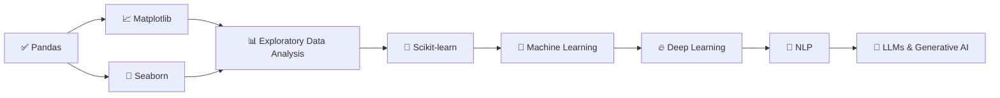

# 📊 Pandas Journey

[](https://python.org)
[](https://pandas.pydata.org)
[](https://jupyter.org)
[]()
[]()

---

This folder documents my complete hands-on learning journey with **Pandas**, the most widely used Python library for data manipulation, cleaning, and analysis.

Throughout this journey, I practiced essential Pandas concepts required for **Data Science**, **Machine Learning**, and **AI** while working with real-world datasets.

---

## 📋 Table of Contents

- [📚 Topics Covered](#-topics-covered)
- [📂 Files & Notebooks](#-files--notebooks)
- [📊 Datasets Used](#-datasets-used)
- [🎯 Learning Outcomes](#-learning-outcomes)
- [📈 Progress Summary](#-progress-summary)
- [🚀 How to Run](#-how-to-run)
- [🔗 Resources & References](#-resources--references)
- [🎯 Next Learning Path](#-next-learning-path)
- [📅 Journey Status](#-journey-status)

---

## 📚 Topics Covered

### ✅ Pandas Basics
- Introduction to Pandas ecosystem
- **Series** – 1D labeled arrays
- **DataFrames** – 2D tabular data structures

### ✅ Importing Data
- Reading CSV Files (`pd.read_csv()`)
- Dataset Inspection Methods
  - `head()` / `tail()` – Quick preview
  - `shape` – Dimensions (rows, columns)
  - `columns` – Column names
  - `dtypes` / `info()` – Data types & memory usage
  - `describe()` – Statistical summary

### ✅ Data Selection
| Method | Use Case |
|--------|----------|
| `df['col']` | Single column selection |
| `df[['col1', 'col2']]` | Multiple columns |
| `df.loc[]` | Label-based indexing |
| `df.iloc[]` | Position-based indexing |
| `df.at[]` / `df.iat[]` | Fast scalar access |

### ✅ Data Filtering
- **Boolean Indexing** – `df[df['col'] > value]`
- **Multiple Conditions** – `&` (AND), `|` (OR), `~` (NOT)
- **isin()** – Filter by list of values
- **between()** – Range filtering
- **query()** – SQL-like filtering syntax

### ✅ Date & Time Handling
- `pd.to_datetime()` – Conversion
- `.dt` accessor for extraction:
  - `.dt.year`, `.dt.month`, `.dt.day`
  - `.dt.weekday`, `.dt.quarter`
  - `.dt.is_weekend`, `.dt.days_in_month`
- Date arithmetic & resampling

### ✅ Sorting & Analysis
- `sort_values()` – Single/multi-column sorting
- `sort_index()` – Index-based sorting
- `unique()` – Distinct values
- `nunique()` – Count of distinct values
- `value_counts()` – Frequency distribution

### ✅ Descriptive Statistics
| Method | Description |
|--------|-------------|
| `describe()` | Summary statistics (count, mean, std, min, quartiles, max) |
| `mean()` / `median()` | Central tendency |
| `std()` / `var()` | Dispersion |
| `min()` / `max()` | Range |
| `quantile()` | Percentiles |
| `corr()` | Correlation matrix |
| `skew()` / `kurt()` | Distribution shape |

### ✅ Data Cleaning
| Technique | Method |
|-----------|--------|
| **Detect Missing** | `isnull()`, `notnull()`, `isna().sum()` |
| **Drop Missing** | `dropna(axis=0/1, how='any/all', thresh=n)` |
| **Fill Missing** | `fillna(value)`, `fillna(method='ffill/bfill')`, `interpolate()` |
| **Replace Values** | `replace()`, `map()` |

### ✅ Duplicate Handling
- `duplicated()` – Identify duplicate rows
- `drop_duplicates(subset=, keep='first/last/False')` – Remove duplicates

### ✅ Data Transformation
- **New Columns** – `df['new'] = expression`
- **Rename** – `rename(columns={})`, `rename(index={})`
- **Apply** – `apply(func)`, `applymap(func)`, `transform(func)`
- **Map/Replace** – `map(dict)`, `replace(to_replace, value)`
- **Discretization** – `cut()`, `qcut()`
- **String Methods** – `.str.lower()`, `.str.contains()`, `.str.extract()`

### ✅ GroupBy Operations
```python
# Single aggregation
df.groupby('category')['value'].sum()

# Multiple aggregations
df.groupby('category').agg({
    'sales': ['sum', 'mean', 'count'],
    'profit': 'max'
})

# Multiple grouping keys
df.groupby(['region', 'category']).mean()

# Transform (returns same shape)
df.groupby('category')['value'].transform('mean')

# Filter groups
df.groupby('category').filter(lambda x: x['sales'].sum() > 1000)
```

### ✅ Exporting Data
- `to_csv(index=False)` – CSV export
- `to_excel()` – Excel export
- `to_json()` – JSON export
- `to_parquet()` – Parquet (columnar, efficient)
- `to_sql()` – Database export

---

## 📂 Files & Notebooks

| File | Description |
|------|-------------|
| [`pandas_basics.ipynb`](pandas_basics.ipynb) | Complete hands-on practice notebook with all topics |
| [`notes.md`](notes.md) | Daily notes, concept explanations, and code snippets |
| [`output.csv`](output.csv) | Sample exported dataset from practice |

---

## 📊 Datasets Used

| Dataset | Source | Description |
|---------|--------|-------------|
| `netflix_titles.csv` | Kaggle | Netflix movies & TV shows metadata |
| `Titanic-Dataset.csv` | Kaggle | Classic Titanic survival dataset |
| `Iris.csv` | UCI ML Repo | Iris flower classification dataset |
| `car_price.csv` | Kaggle | Used car price prediction data |
| `credit_card_fraud_10k.csv` | Kaggle | Credit card fraud detection (imbalanced) |
| `WineQT.csv` | UCI ML Repo | Wine quality regression dataset |
| `House Price Prediction Dataset.csv` | Kaggle | Housing price prediction features |

> 💡 All datasets are available in the root directory of this repository.

---

## 🎯 Learning Outcomes

After completing this journey, I can:

### Data Ingestion & Inspection
- [x] Load datasets from CSV, Excel, JSON, SQL, and Parquet
- [x] Perform initial exploratory data analysis (EDA)
- [x] Understand data types, memory usage, and data quality issues

### Data Manipulation
- [x] Select, filter, and slice data using `loc`, `iloc`, and boolean indexing
- [x] Handle missing data with multiple strategies
- [x] Detect and remove duplicate records
- [x] Transform data: create features, rename, apply functions

### Data Analysis
- [x] Compute descriptive statistics and correlation matrices
- [x] Perform GroupBy operations with multiple aggregations
- [x] Work with datetime data: parsing, extraction, arithmetic
- [x] Sort, rank, and identify unique/value counts

### Data Export & Pipeline Ready
- [x] Export cleaned data to multiple formats
- [x] Prepare datasets for Machine Learning pipelines
- [x] Understand method chaining for readable code

---

## 📈 Progress Summary

| # | Topic | Status | Notebook Section |
|---|-------|--------|------------------|
| 1 | Pandas Basics (Series, DataFrame) | ✅ | `01_basics` |
| 2 | Importing & Inspecting Data | ✅ | `02_import` |
| 3 | Data Selection (loc, iloc) | ✅ | `03_selection` |
| 4 | Data Filtering (Boolean, Query) | ✅ | `04_filtering` |
| 5 | DateTime Handling | ✅ | `05_datetime` |
| 6 | Sorting & Unique Analysis | ✅ | `06_sorting` |
| 7 | Descriptive Statistics | ✅ | `07_statistics` |
| 8 | Missing Value Handling | ✅ | `08_missing` |
| 9 | Duplicate Handling | ✅ | `09_duplicates` |
| 10 | Data Transformation | ✅ | `10_transform` |
| 11 | GroupBy Operations | ✅ | `11_groupby` |
| 12 | Exporting Data | ✅ | `12_export` |

---

## 🚀 How to Run

### Prerequisites
```bash
# Create virtual environment (recommended)
python -m venv venv
source venv/bin/activate  # Linux/Mac
venv\Scripts\activate     # Windows

# Install dependencies
pip install pandas jupyter matplotlib seaborn
```

### Launch Notebook
```bash
cd Pandas
jupyter notebook pandas_basics.ipynb
```

### Run Individual Cells
- Execute cells sequentially (Shift+Enter)
- Modify parameters to experiment
- Save outputs with `File > Save and Checkpoint`

---

## 🔗 Resources & References

### Official Documentation
- [Pandas User Guide](https://pandas.pydata.org/docs/user_guide/index.html)
- [API Reference](https://pandas.pydata.org/docs/reference/index.html)
- [10 Minutes to Pandas](https://pandas.pydata.org/docs/user_guide/10min.html)

### Tutorials & Cheatsheets
- [Pandas Cheat Sheet](https://pandas.pydata.org/Pandas_Cheat_Sheet.pdf) (Official)
- [Data School Pandas Videos](https://www.dataschool.io/easier-data-analysis-with-pandas/)
- [Kaggle Pandas Course](https://www.kaggle.com/learn/pandas)

### Best Practices
- [Modern Pandas (Tom Augspurger)](https://tomaugspurger.github.io/modern-1-intro.html)
- [Effective Pandas (Matt Harrison)](https://www.mattwharrison.com/effective-pandas/)
- [Pandas Style Guide](https://pandas.pydata.org/docs/development/contributing_code_style.html)

---

## 🎯 Next Learning Path



| Step | Topic | Focus |
|------|-------|-------|
| 1 | **Matplotlib** | Core plotting, customization, subplots |
| 2 | **Seaborn** | Statistical visualizations, themes |
| 3 | **EDA** | End-to-end analysis workflows |
| 4 | **Scikit-learn** | ML pipelines, preprocessing, models |
| 5 | **Machine Learning** | Supervised/Unsupervised, evaluation |
| 6 | **Deep Learning** | Neural networks, PyTorch/TensorFlow |
| 7 | **NLP** | Text processing, transformers |
| 8 | **GenAI** | LLMs, RAG, Agents, Fine-tuning |

---

## 📅 Journey Status

| Milestone | Status | Completion |
|-----------|--------|------------|
| Python Fundamentals | ✅ Completed | Week 1-2 |
| NumPy Fundamentals | ✅ Completed | Week 3 |
| **Pandas Fundamentals** | ✅ **Completed** | **Week 4** |
| Matplotlib & Seaborn | 🔜 In Progress | Week 5 |
| Exploratory Data Analysis | ⏳ Planned | Week 6 |
| Scikit-learn & ML Basics | ⏳ Planned | Week 7-8 |
| Machine Learning Projects | ⏳ Planned | Week 9-10 |
| Deep Learning | ⏳ Planned | Week 11-12 |
| NLP & LLMs | ⏳ Planned | Week 13-14 |
| Generative AI Projects | ⏳ Planned | Week 15+ |

---

## ⭐ Why This Repository?

This repository is part of my **AI Engineer Learning Journey**, where I document every concept, practice notebook, and daily progress while building a strong foundation in:

- **Artificial Intelligence**
- **Machine Learning**
- **Deep Learning**
- **Generative AI & LLMs**

Each folder represents a milestone with:
- 📓 Hands-on Jupyter notebooks
- 📝 Detailed markdown notes
- 📊 Real dataset practice
- ✅ Progress tracking

---

## 🤝 Connect & Feedback

If you find this helpful or have suggestions, feel free to:

- ⭐ **Star** this repository
- 🐛 **Open an Issue** for bugs or improvements
- 💬 **Discussions** for questions
- 🔄 **Fork** and adapt for your own journey

---

> **“The goal is to turn data into information, and information into insight.”**  
> — *Carly Fiorina*

---

*Last updated: August 2025 | Part of [AI-Engineer-Journey](../README.md)*